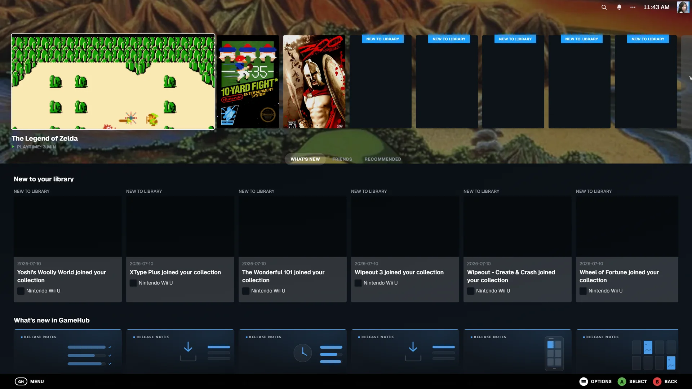
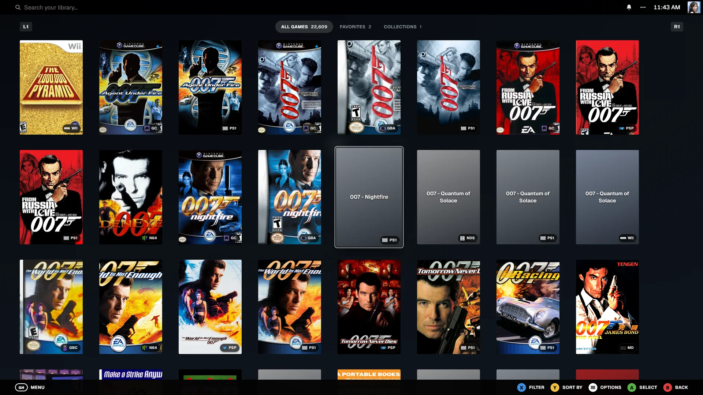
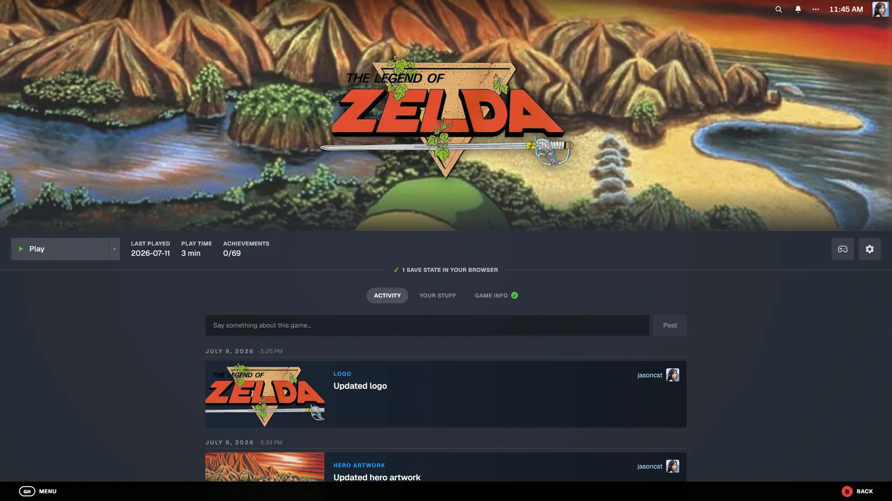
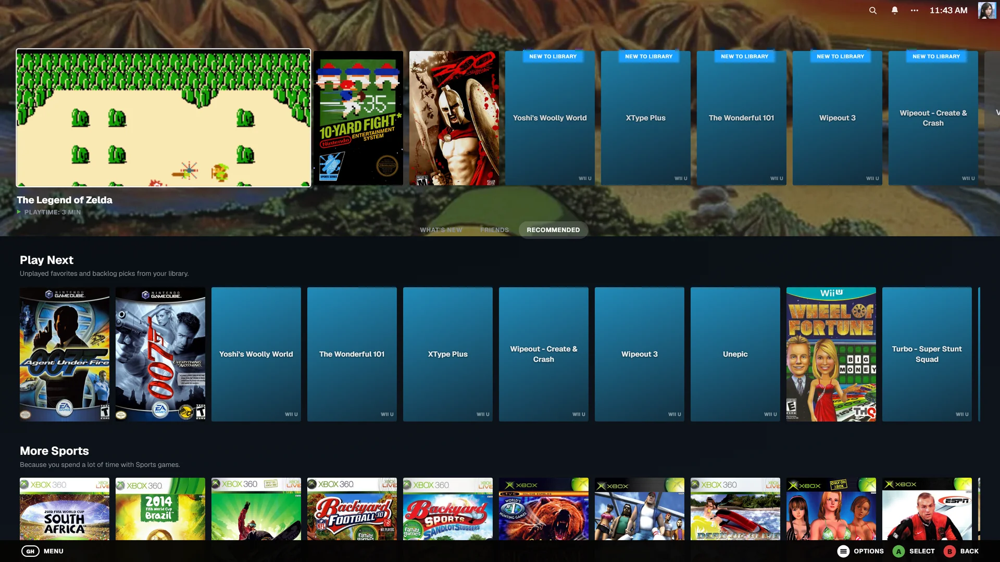
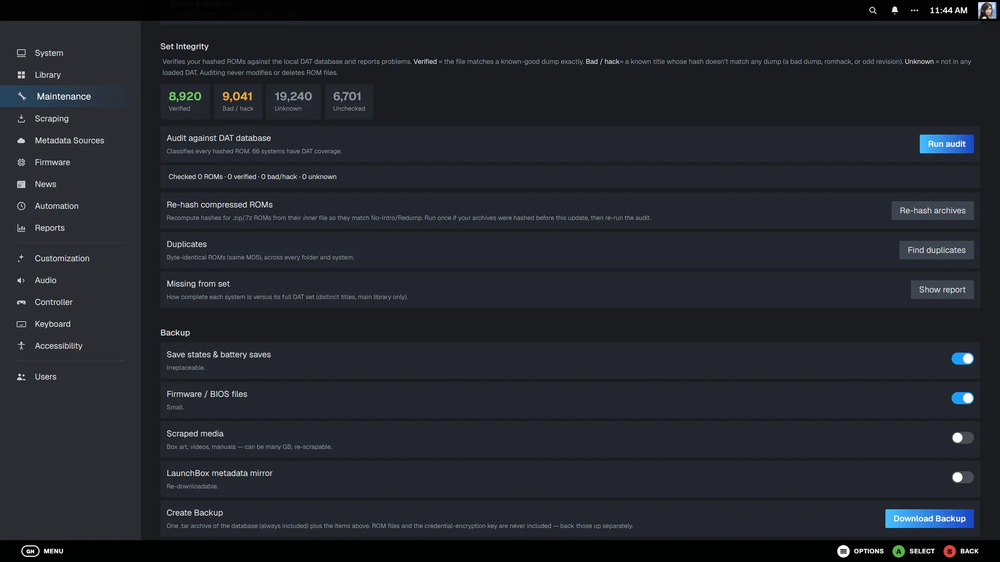
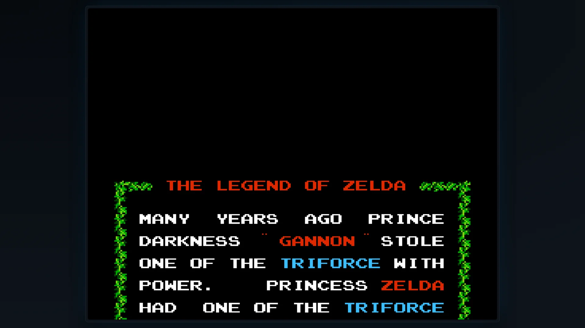

<p align="center">
  
</p>

<h1 align="center">GameHub</h1>

<p align="center">
  <strong>Your ROM collection, as a Steam Deck.</strong><br/>
  A self-hosted retro game library with a SteamOS-style interface — box art, rich
  metadata, collections, achievements, playtime, and one-click play in the browser.
</p>

<p align="center">
  <a href="https://hub.docker.com/r/shadowtek5/gamehub"></a>
  <a href="https://hub.docker.com/r/shadowtek5/gamehub"></a>
  <a href="https://hub.docker.com/r/shadowtek5/gamehub"></a>
  <a href="https://github.com/shadowtek5/gamehub"></a>
  <br/>
  
  
  
  
  
</p>

---

Point GameHub at your existing ROM folders and get a Steam Deck-like experience
in any browser — full controller navigation on desktop, touch-first on mobile.
It scans in place (your ROMs are never modified), scrapes art and metadata from
a dozen sources, verifies your collection against No-Intro/Redump datfiles, and
plays dozens of consoles right in the browser. Everything runs in one container.

## Table of contents

- [Screenshots](#screenshots)
- [Highlights](#highlights)
- [Features](#features)
- [Quick start (Docker)](#quick-start-docker)
- [Quick start (without Docker)](#quick-start-without-docker)
- [Organizing your ROMs](#organizing-your-roms)
- [Metadata providers](#metadata-providers)
- [Set integrity & the DAT database](#set-integrity--the-dat-database)
- [Playing](#playing)
- [Collections](#collections)
- [Users & security](#users--security)
- [Export & interoperability](#export--interoperability)
- [API](#api)
- [Data & backup](#data--backup)
- [Tech stack](#tech-stack)
- [Roadmap](#roadmap)
- [FAQ](#faq)
- [Development](#development)
- [Contributing](#contributing)
- [Credits](#credits)

## Screenshots

<table>
  <tr>
    <td width="50%"><br/><sub><b>Home</b> — Big Picture layout, recent games & What's New feed</sub></td>
    <td width="50%"><br/><sub><b>Library</b> — cover grid with filters, search & variants</sub></td>
  </tr>
  <tr>
    <td width="50%"><br/><sub><b>Game</b> — hero art, metadata, play, saves & achievements</sub></td>
    <td width="50%"><br/><sub><b>Recommended</b> — Play Next, Jump Back In, hidden gems</sub></td>
  </tr>
  <tr>
    <td width="50%"><br/><sub><b>Set Integrity</b> — verify, dedupe & missing-from-set</sub></td>
    <td width="50%"><br/><sub><b>Play</b> — in-browser emulation with controller support</sub></td>
  </tr>
</table>

> Screenshots live in [`docs/screenshots/`](docs/screenshots). See that folder's
> README for the exact shot list if you're regenerating them.

## Highlights

- 🕹️ **Play in the browser** — dozens of systems via EmulatorJS, Flash via Ruffle. No streaming server, nothing to install.
- 🎨 **12 metadata sources** compose into one library — art, descriptions, videos, manuals, achievements.
- 🔎 **Set integrity** — verify every ROM against No-Intro/Redump, find duplicates, see what you're missing (region-aware).
- 🗃️ **Scans in place** — ROMs are never moved or modified; mount read-only to be sure.
- 👥 **Multi-user** with roles, invites, OIDC SSO, and private per-user data.
- 🎮 **Controller-first** Big Picture UI with a Steam-style button remapper.
- 📱 **Full mobile app** at `/mobile` — the whole library, touch-first.
- 🔌 **REST API + Swagger** with scoped, optionally-expiring tokens.
- 🔐 **Hardened**: hashed sessions/tokens, encrypted secrets, SSRF-guarded fetches, rate-limited login.

## Features

<details open>
<summary><b>Library</b></summary>

- Scans your existing ROM folders **in place** — files are never moved or altered (only explicit admin rename/delete/upload actions ever touch them; mount the volume read-only to forbid even those)
- 100+ systems recognized by file extension and folder name, with editable per-system folder mappings and *variant* subfolders (hacks, translations, digital, prototypes…)
- Region, revision and multi-disc parsing from No-Intro/Redump-style names — `(USA)`, `(Rev A)`, `(v1.1)`, `(Disc 2)` become distinct, labelled versions; discs group under one game with a combined zip download
- Optional automatic upkeep: a filesystem watcher and post-scan cleanup
- Background file hashing (CRC32/MD5/SHA-1), including the **inner file of `.zip` ROMs** so compressed games hash-match, with exact identification via [Hasheous](https://hasheous.org/) and the local DAT database
</details>

<details>
<summary><b>Set integrity & verification</b></summary>

- Local DAT hash database built on demand from the full **No-Intro** (cartridges), **Redump** (discs) and optional **MAME / FinalBurn Neo** (arcade) sets
- **Set Integrity** audit labels every hashed ROM *Verified* / *Bad-or-hack* / *Unknown* — a background job with live progress that never modifies ROMs
- Byte-identical **duplicate** finder (grouped by hash, across every folder)
- **Missing-from-set** report per system with a region preference (default North America) that falls back automatically for region-exclusive consoles like the Famicom
</details>

<details>
<summary><b>Metadata & artwork</b></summary>

- Providers: ScreenScraper, IGDB, MobyGames, TheGamesDB, SteamGridDB, EmuMovies (videos + manuals), the offline LaunchBox Games Database (183k+ games), libretro-thumbnails, HowLongToBeat, Flashpoint and RetroAchievements
- Provider priority you control, per-item toggles (description, details, box art, hero art, clear logos, icons, screenshots, videos, manuals, badges), and 2D or 3D box art
- Bulk scrape (missing-only or everything, per selected systems), per-system scrape from each system page, and per-game scrape / re-match
- Fix mismatches by hand: search candidates across providers, pick box/hero/logo art from every source, or edit any field directly — manual edits survive rescans
- Manuals in a built-in PDF viewer, video snaps, game trailers (from IGDB), theme music (YouTube or upload), language flags on covers, and genre/language/variant filters
</details>

<details>
<summary><b>Play</b></summary>

- **In-browser emulation via EmulatorJS** — dozens of systems (NES, SNES, N64, GB/GBC/GBA, DS, Genesis, Master System, Game Gear, Sega CD/32X, PC Engine, PlayStation, Atari, Neo Geo, arcade, and more) at native speed; **Flash** games via Ruffle. No streaming server, no extra app
- **BIOS/firmware manager** — upload BIOS files once; GameHub verifies them by checksum and hands them to the emulator automatically
- **Saves that follow you** — save states with labels, screenshots and upload/download, plus cartridge battery saves synced to the server (periodically and on exit)
- **Controllers everywhere** — a gamepad drives the entire Big Picture UI, with a Steam-style button remapper (family / system / per-game layouts) applied in the emulator
- **In-browser ROM patcher** (IPS/UPS/BPS) — patches a copy, originals untouched
</details>

<details>
<summary><b>Home dashboard</b></summary>

- A SteamOS Big Picture home with your recent games, then a **Recommended** tab of curated shelves — Play Next, Jump Back In, more from your favourite genre, hidden gems, and a system deep-dive
- A **What's New** feed combining new-to-library games, GameHub release notes, automatic library milestones, admin announcements, and community ROM-hacking / translation news from RSS/Atom feeds you configure — with a **View more** tile that opens the full, date-grouped GameHub changelog on its own page
</details>

<details>
<summary><b>Multi-user</b></summary>

- Roles: admin / editor / viewer, single-use invite links, open or closed registration
- A live **Activity Log** (admin-only) recording system events as they happen — scans, scrapes, user & role changes, settings edits and maintenance — each attributed to who triggered it, filterable by category
- OpenID Connect single sign-on (Authelia, Authentik, Keycloak, Google…)
- Per-user favorites, play status, playtime, notes, ratings, difficulty, completion and hidden games — private to each account
- Steam-style profiles: levels, badges, comments, recent activity
- Per-user RetroAchievements account linking, shown on game pages
</details>

## Quick start (Docker)

```bash
git clone https://github.com/shadowtek5/gamehub.git && cd gamehub
# edit docker-compose.yml (ROM volume, timezone, PUID/PGID) — comments explain each
docker compose up -d
```

The published image is [`shadowtek5/gamehub:latest`](https://hub.docker.com/r/shadowtek5/gamehub)
(the compose file already points at it). Open <http://localhost:3000> — the
first account you register becomes the admin, and the setup wizard handles the
rest:

1. **Library** — point GameHub at your ROM folder (`/roms` if you used the compose example). It detects one system per subfolder; an empty folder is fine if you're starting fresh.
2. **Metadata** — all optional. The one-click LaunchBox import needs no account and covers 183k+ games; add provider accounts for richer data (each card explains what it adds and has a Test button).
3. **First scan** — builds the library and optionally starts a background scrape.

Everything in the wizard can be changed later under **Settings**.

### Volumes

| Mount | Purpose |
| --- | --- |
| `/app/data` | Database, scraped media, saves, firmware, DAT database — **back this up** |
| `/roms` (your choice) | Your ROM library; mount as many roots as you like, `:ro` to keep it read-only |

ROMs can live on a local disk or a NAS via SMB/CIFS or NFS — ready-to-uncomment
examples for both are in [docker-compose.yml](docker-compose.yml). `\\nas\share`
UNC paths don't exist inside a Linux container; a CIFS volume makes the share
appear as a normal folder.

### Environment variables

GameHub is configured in the app, not through env vars. The full list:

| Variable | Default | Purpose |
| --- | --- | --- |
| `TZ` | UTC | Container timezone |
| `PUID` / `PGID` | `1000` / `1000` | User/group GameHub runs as; it takes ownership of `/app/data` on start. Set to the owner of your mounted folders (Synology: run `id yourusername` — often `1026`/`100`) |
| `SCREENSCRAPER_DEVID` | *(built in)* | Override the embedded ScreenScraper app identity |
| `SCREENSCRAPER_DEVPASSWORD` | *(built in)* | Override, as above |
| `PORT` / `HOSTNAME` | `3000` / `0.0.0.0` | Internal listen address — change the compose `ports:` mapping instead |

### Updating

**From inside the app (recommended).** Go to **Settings → System → Software
updates**. GameHub checks GitHub for a newer release and installs it for you —
click **Download & install**, then **Restart to apply**. Turn on **automatic
updates** to have it check (and optionally install) new versions on its own, or
**upload a release `.zip`** you downloaded yourself to install it manually.

How it works and why it's safe:

- Each release is a pre-built bundle (`gamehub-<version>.zip`) staged under
  `/app/data/app` — your ROMs, database, and media are never touched.
- Every bundle is verified by **SHA-256** before it's applied.
- The build baked into the Docker image is kept as a **fallback floor**: if a
  staged update fails to start three times in a row the entrypoint
  **automatically reverts** to the previous working version, so an update can't
  brick your instance. You can also revert to any earlier installed version from
  the Advanced section.
- In-app updates require the Docker runtime with `restart: unless-stopped` (the
  restart is what applies the new version). Non-Docker installs update the
  classic way below.

**The classic way** (still works, and is how non-Docker installs update):

```bash
docker compose pull && docker compose up -d
```

The database migrates itself forward automatically; migrations are additive.

#### Publishing a release (maintainers)

In-app / automatic updates pull from this repo's **GitHub Releases**. To cut a
release, build the bundle **inside the Linux runtime** so the bundled native
modules (`better-sqlite3`, `sharp`) match the container, then attach the
artifacts to a GitHub Release tagged `v<version>`:

```bash
# inside node:22-bookworm-slim (linux-x64) — matches the container
BUILD_STANDALONE=1 npm run build
npm run release          # → dist/gamehub-<version>.zip + .sha256 + latest.json
```

Attach `gamehub-<version>.zip` **and** `gamehub-<version>.zip.sha256` to a
Release tagged `v<version>` (mark it *pre-release* for the beta channel). Clients
pick it up on their next check.

## Quick start (without Docker)

Requires Node.js 22+.

```bash
npm install
npm run build
npm run start          # production on http://localhost:3000
# npm run dev          # development
```

To reach it from other devices: `npm run start -- -H 0.0.0.0`.

## Organizing your ROMs

GameHub expects (but doesn't require) one folder per system under a common root:

```
roms/
├── snes/
│   ├── Chrono Trigger (USA).sfc
│   └── hacks/                       <- variant subfolder
├── gb/
├── psx/
│   ├── Final Fantasy VII (Disc 1).chd
│   └── Final Fantasy VII (Disc 2).chd
└── flash/
```

- **Platform detection** — unambiguous extensions (`.sfc`, `.z64`, `.gba`…) match anywhere; ambiguous ones (`.zip`, `.bin`, `.iso`, `.chd`) are resolved by the folder name (`snes`, `n64`, `playstation`, and aliases). Mappings are editable under **Settings → Library**.
- **Variants** — subfolders named `hacks`, `translations`, `digital` (etc.) tag their games, and each system page gets a filter for them.
- **Multi-disc** — discs group under one game; the game page links every disc and offers a combined zip download, and you can export `.m3u` playlists.
- **No-Intro / Redump names** (`Game (USA) (Rev A).ext`) give the best automatic matches for art, region/revision detection and DAT verification — but scrapers and manual re-matching handle messy names too.

## Metadata providers

Every provider is optional and they compose — set a priority order and the first
source that has an item wins. Configure under **Settings → Metadata Sources**
(each has a **Test** button). Credentials are **encrypted at rest** (AES-256-GCM).

| Provider | Account | What it adds |
| --- | --- | --- |
| **LaunchBox GamesDB** | none — one ~100 MB download, then fully offline | titles, descriptions, genres, dates, ratings, box art for 183k+ games |
| **ScreenScraper** | free account (app identity ships built in) | the deepest retro DB: descriptions, genres, players, ratings, dates, 2D/3D box art, screenshots, videos |
| **IGDB** | free Twitch app ([dev.twitch.tv](https://dev.twitch.tv/console/apps)) | modern curated metadata, franchises, covers, screenshots, trailers, similar & related games |
| **MobyGames** | free API key ([mobygames.com/info/api](https://www.mobygames.com/info/api/)) | long-tail coverage of obscure/older titles |
| **TheGamesDB** | free public API key ([forums.thegamesdb.net](https://forums.thegamesdb.net/viewforum.php?f=10)) | community metadata + boxart, fanart, clear logos, screenshots |
| **SteamGridDB** | free API key | Steam-style hero banners, grids, logos |
| **EmuMovies** | supporter account (FTP) | video snaps and scanned game manuals |
| **RetroAchievements** | free account + Web API key | achievements, badges, unlock progress |
| **libretro-thumbnails** | none, always on | box art matched by filename |
| **Hasheous** | none, always on | exact identification by file hash |
| **HowLongToBeat** | none, always on | completion times |
| **Flashpoint** | none, always on | Flash game metadata |

## Set integrity & the DAT database

**Settings → Metadata Sources → No-Intro / Redump / MAME Database** downloads the
DAT sets you choose (cartridges + discs by default; arcade/computer sets are
larger and opt-in) into a local, fully-offline hash database. Then **Settings →
Maintenance → Set Integrity** lets you:

- **Run audit** — classify every hashed ROM as Verified / Bad-or-hack / Unknown against the DATs (background job, live progress).
- **Re-hash archives** — recompute `.zip`/`.7z` hashes from the inner ROM so compressed games hash-match.
- **Find duplicates** — byte-identical ROMs across every folder, with wasted space totalled.
- **Missing from set** — per-system completeness versus the full DAT set, scoped to your region with automatic fallback for region-exclusive consoles.

## Playing

- **In-browser** — click **Play** on any game and it runs in the browser through EmulatorJS (emulated systems) or Ruffle (Flash). Nothing to install; works on desktop and mobile.
- **Firmware/BIOS** (Settings → Firmware or a system page ⚙) — upload BIOS files once; GameHub verifies known checksums and provides them to the emulator when a system needs them.
- **Saves** — save states (labels + screenshots, download/upload) and cartridge battery saves synced to the server, so progress travels across devices.
- **Controllers** — plug in any gamepad; the D-pad/stick drives the whole UI. Remap physical → console buttons Steam-style, with family / system / per-game layouts applied in the emulator.
- **Playtime** — tracked automatically and shown Steam-style on cards.

> In-browser play loads emulator cores from the EmulatorJS CDN, so the browser
> needs outbound internet the first time a core is used.

## Collections

- **Manual** — pick games by hand; keep them private or public.
- **Smart** — saved filters (platform, genre, franchise, rating, play status, favorites…) with any/all logic per field; membership updates automatically.
- **Virtual** — automatic groupings by genre, developer, publisher and franchise.

## Users & security

| Role | Can |
| --- | --- |
| **Viewer** | browse, play, keep personal data (favorites, saves, notes, hidden games) |
| **Editor** | + edit metadata, scrape, fix matches, upload ROMs |
| **Admin** | + user management, settings, library folders, scans, firmware, backups, danger-zone file actions |

- First registered account = admin. After that, open registration can be disabled and **invite links** (single-use, role-scoped, expiring) handed out instead.
- **OIDC single sign-on** (Settings → Users): discovery URL + client credentials, PKCE, CSRF-protected callback. Accounts link strictly by IdP subject; attaching SSO to an existing account is an explicit signed-in action.
- **Profiles**: levels and badges from library/play milestones, comments, recent games — plus per-game notes, ratings, difficulty, completion and hidden flags that stay yours.

**Security posture:** passwords are bcrypt-hashed; session and API tokens are
stored only as SHA-256 hashes; session cookies are `HttpOnly`/`SameSite=Lax` and
marked `Secure` over HTTPS; login is rate-limited; provider/SSO secrets are
AES-256 encrypted at rest; and server-side "fetch from URL" actions are guarded
against SSRF. Put a reverse proxy (Caddy, nginx, Traefik) in front for HTTPS.

## Languages

The interface ships in **19 languages**: English, Arabic, Chinese, Danish,
Dutch, Finnish, French, German, Greek, Italian, Japanese, Korean, Norwegian,
Polish, Portuguese, Russian, Serbian, Spanish and Swedish — with full
right-to-left layout for Arabic. On a visitor's first request the
language is picked from their browser's `Accept-Language` header; each user can
override it under **Settings → Language** (or their Account/Profile screen), and
the choice is saved to their account (via `user_settings`) so it follows them
across devices. The active locale lives in a `gh-locale` cookie — no language
segment is added to URLs. Any key a locale hasn't translated yet falls back to
English (merged in `src/i18n/request.ts`), so partial locales never show gaps.
Localization spans the navigation, menus, library, game pages, settings and
more, and expands with each release.

**Adding a language** (no code changes needed for the strings themselves):

1. Add the locale code to `LOCALES` and a native label to `LOCALE_LABELS` in
   [`src/i18n/locales.ts`](src/i18n/locales.ts).
2. Copy [`src/messages/en.json`](src/messages/en.json) to
   `src/messages/<code>.json` and translate the values (keep the keys and any
   `{placeholders}` intact).

That's it — the switcher, browser detection and `<html lang>` pick it up
automatically. Translations are built on [`next-intl`](https://next-intl.dev).

## Export & interoperability

From any system's ⚙ menu, export the library for other launchers:

- **`gamelist.xml`** — EmulationStation / ES-DE, with your scraped metadata
- **RetroArch `.lpl`** — a ready playlist using each ROM's real path and CRC
- **`.m3u`** — per-game multi-disc playlists (zipped)

`gamelist.xml` **import** (Settings → Library) also fills metadata you already have.

## API

Interactive docs live at **`/api-docs`** (Swagger UI over `/api/openapi.json`).
Create personal access tokens under **Account → API tokens** — each has a scope
(full / editor / viewer) that caps what it can do, and an optional expiry:

```bash
curl -H "Authorization: Bearer ghk_xxxxxxxx" \
  "http://localhost:3000/api/library?q=zelda"
```

Endpoints cover the whole app: library search/facets, platforms, ROM metadata +
personal data, saves/states, collections (incl. smart/virtual), firmware,
scanning, scraping jobs, set-integrity audit, exports, users/invites, stats and
media.

## Data & backup

Everything GameHub creates lives in one folder (the `/app/data` volume in
Docker, `./data` natively):

```
data/
├── gamehub.db      # SQLite database (library, users, settings, playtime)
├── media/          # scraped box art, heroes, screenshots, videos, manuals
├── saves/          # save states
├── battery/        # cartridge battery saves
├── firmware/       # uploaded BIOS files
├── dat.db          # No-Intro/Redump/MAME hash database (re-downloadable)
└── launchbox.db    # offline LaunchBox metadata mirror (re-downloadable)
```

**Built-in backup & restore** (Settings → Maintenance) downloads a single `.tar`
with a consistent live snapshot of the database plus your choice of saves,
firmware, scraped media and the metadata mirrors — restorable from the same
screen or the setup wizard. Automated backups can be scheduled under Settings →
Automation. ROMs are never part of a backup.

## Tech stack

| Layer | Technology |
| --- | --- |
| Framework | Next.js 16 (App Router), React 19, TypeScript 5 |
| Styling | Tailwind CSS v4 — a from-scratch SteamOS Big Picture clone |
| Data | SQLite via better-sqlite3, self-migrating schema at startup |
| Emulation | EmulatorJS (libretro WASM cores) + Ruffle (Flash) |
| Media | sharp (WebP transcode), streaming ZIP downloads |
| Auth | bcrypt, hashed sessions/API tokens, OIDC (PKCE), AES-256-GCM secret sealing |
| Packaging | Docker (`node:22` standalone output), gosu for PUID/PGID |

## Roadmap

Ideas and known gaps — contributions welcome:

- **CHD / 7z conversion** in-app (currently deferred — needs a viable pure-JS/WASM path)
- **MAME parent/clone** merged/split set rebuilding
- A friends/social graph beyond shared profiles
- Screenshot gallery refresh in this README (see [`docs/screenshots/`](docs/screenshots))

## FAQ

**"unable to open database file" / `SQLITE_CANTOPEN` on a NAS?** The mounted data
folder isn't writable by the container's user. Set `PUID`/`PGID` to the owner of
the folder (Synology: `id yourusername` over SSH, commonly `1026`/`100`) and
restart — GameHub takes ownership of `/app/data` on start.

**Can I change the port?** Edit the left side of `ports:` in docker-compose.yml
(e.g. `8080:3000`).

**HTTPS?** Put any reverse proxy in front of port 3000. Cookies are marked
`Secure` automatically when the request arrives over HTTPS.

**A game won't play in the browser.** Check the system's BIOS is uploaded
(Settings → Firmware) and that the browser can reach the EmulatorJS CDN; large
disc images load more slowly than cartridges.

**ScreenScraper says quota/closed?** Their servers rate-limit per account and
close during peak hours; scrapes resume where they left off.

**ScreenScraper test fails with `CERT_HAS_EXPIRED`?** Enable **Ignore TLS
certificate errors** in Settings → Metadata Sources → ScreenScraper (scoped to
`api.screenscraper.fr` only), and turn it back off once their cert is fixed.

**Why is a game unmatched/wrong?** Use Manage ▾ → *Fix match* to search
candidates across providers, or Properties to edit fields directly. Hash matching
(Settings → Scraping) and the DAT database fix renamed files.

**Is anything ever written to my ROM folders?** Scans are read-only. Only
explicit admin actions (rename, delete, upload via the UI) write there — mount
the volume `:ro` to forbid even those.

**Reset the app?** Stop GameHub and delete the data folder. Your ROMs are
untouched.

## Development

```bash
npm run dev
```

Next.js App Router + TypeScript + Tailwind v4; SQLite via better-sqlite3 (schema
migrates automatically at startup in `src/lib/db.ts`); in-browser emulation via
EmulatorJS, Flash via Ruffle.

## Contributing

Issues and PRs are welcome. A few house rules:

- **Keep migrations additive** — the schema self-migrates at startup; never write a destructive migration.
- **Never touch ROM files** outside the explicit admin rename/delete/upload actions.
- **Scope every API route** with the shared auth guards (`requireAdmin` / `requireEditor` / `requireLogin`).
- **Ship the changelog** — add a `What's New` entry in `src/lib/news/appNews.ts` for any notable feature.
- This is a modified Next.js with breaking changes — see [AGENTS.md](AGENTS.md) and read `node_modules/next/dist/docs/` before writing framework code.

## License

Copyright © 2026 GameHub contributors.

GameHub is free software licensed under the **GNU Affero General Public License
v3.0** — see [LICENSE](LICENSE). You may use, study, share and modify it; if you
run a modified version as a network service, the AGPL requires you to offer that
version's source to its users.

> **Disclaimer:** GameHub ships **no games, ROMs, or BIOS files** — you supply
> your own. It's a library manager for content you already own the right to use;
> obtaining or distributing copyrighted ROMs/BIOS may be illegal in your
> jurisdiction. Emulator cores (EmulatorJS/libretro, Ruffle) and metadata are
> provided by their respective projects under their own licenses.

## Credits

Interface inspired by SteamOS / Steam Deck. Feature set inspired by the excellent
[RomM](https://romm.app/). In-browser emulation by
[EmulatorJS](https://emulatorjs.org/) (built on [libretro](https://www.libretro.com/)
cores) and [Ruffle](https://ruffle.rs/) for Flash. Metadata thanks to
ScreenScraper, IGDB, MobyGames, TheGamesDB, SteamGridDB, EmuMovies, the LaunchBox
Games Database, libretro-thumbnails, Hasheous, HowLongToBeat, Flashpoint and
RetroAchievements; DAT data from the libretro-database mirror of No-Intro,
Redump, MAME and FinalBurn Neo.

**UI sound effects** are original synthesized effects created for GameHub by
[scripts/gen-sounds.mjs](scripts/gen-sounds.mjs) and dedicated to the public
domain ([CC0](https://creativecommons.org/publicdomain/zero/1.0/)). No
Valve/Steam audio assets are included.
</content>
